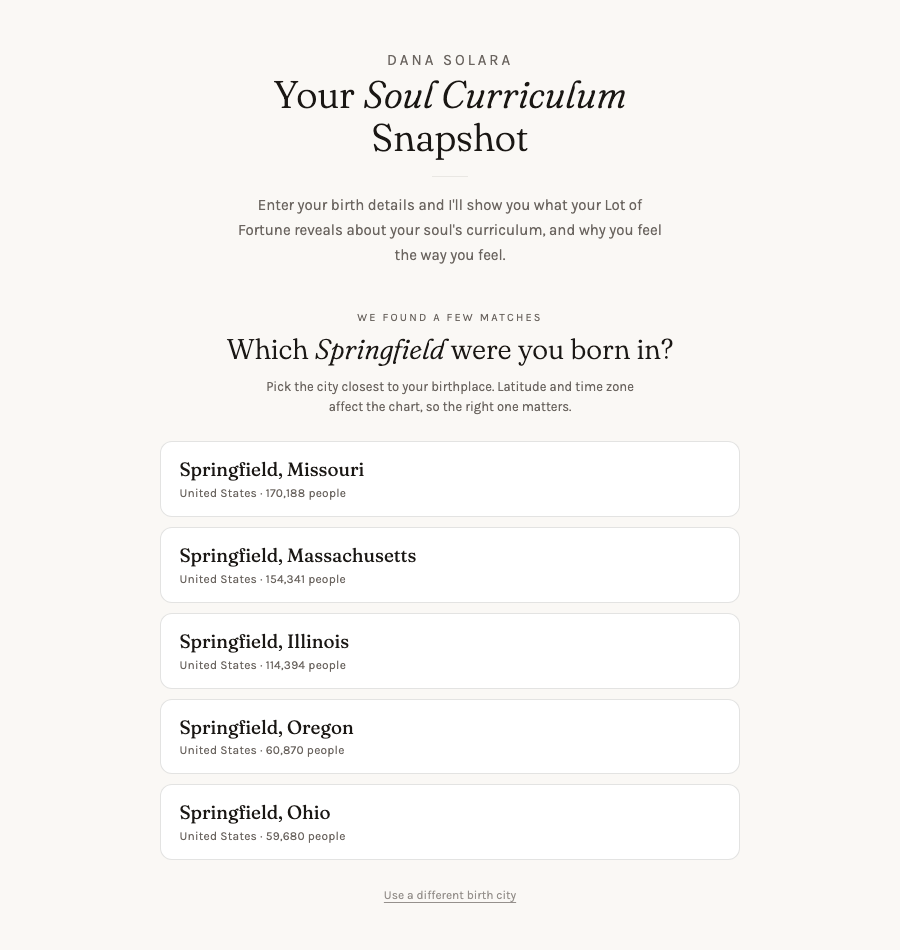

# Path to Purpose — Case Study

A Hellenistic astrology lead-magnet tool built for [Dana Solara](https://danasolara.com), a self-help educator working with millennial women on patterns of self-abandonment and chronic people-pleasing.

**Live:** [fortune.danasolara.com](https://fortune.danasolara.com)


A visitor enters their birth details and receives:

1. Their **Lot of Fortune** placement (Hellenistic "soul curriculum" calculation).
2. A 180–220 word interpretation written in the client's voice via the Anthropic Claude API.
3. A **Zodiacal Releasing** timeline mapped to whole-sign houses with traditional planetary rulers, current chapter highlighted.
4. Locked teasers for the rest of the client's paid program plus a webinar CTA.

---

## The result

| Form | City disambiguation | Loading | Reading + timeline |
|---|---|---|---|
|  |  |  |  |

---

## What made this interesting

Most "AI tool" lead magnets are thin wrappers around an LLM call. This one had to be correct under genuine domain rigor, sound like its author, and protect both the client's bill and her IP.

### 1. The Hellenistic math had to actually be right

The client teaches a traditional astrological framework, so the Lot of Fortune, whole-sign houses, sect determination, and Zodiacal Releasing all had to compute correctly. The vendor that supplies western chart data had several subtle issues that meant trusting their convenience fields would have shipped wrong readings:

- **Whole-sign houses, not Placidus.** The chart endpoint returns Placidus by default; planets were remapped to whole-sign in JavaScript so the housing matched the tradition the client teaches.
- **Degree-based sect, not house-based.** The common heuristic "Sun above the horizon = day chart" fails under whole-sign because the Sun can sit in house 1 while above the eastern horizon. The fix is a 360°-arc comparison between Sun and Ascendant.
- **Lot of Fortune computed locally**, not read from the vendor's `Part of Fortune` field. Their field used different sect logic and produced wrong results for a non-trivial slice of birth charts.

```js
// Whole-sign house assignment after remapping (sketch)
const houseForPlanet = ((planetSignIdx - ascSignIdx + 12) % 12) + 1;

// Degree-based sect determination
const sunFromAsc = ((sunDeg - ascDeg + 360) % 360);
const isDayChart = sunFromAsc > 180;
```

Each of these took real debugging against a canonical test case (a known birth with known correct output) before shipping.

### 2. Brand voice had to survive every generation

The client has strong, specific voice rules for how readings should sound. Some are stylistic, some are non-negotiable. A reading that violates them does not just read off — it reads off-brand, which is worse than no reading at all on a lead magnet.

Two layers handle this:

- **The prompt is built server-side**, never on the client. The voice rules and brand instructions live on the server. A user cannot inspect them by viewing source, and they cannot inject overrides through the form because the prompt template is constructed after input validation.
- **A post-generation safety net** strips a small set of specific tokens that the model occasionally slips in despite explicit rules forbidding them. Belt and suspenders for the rules the client cares about most.

```js
// Defensive post-process: strip a forbidden punctuation token
// that violates the brand voice rules even when the prompt says not to use it.
const text = rawClaudeOutput.replace(/[—–]/g, ', ');
```

### 3. The geo lookup had to actually disambiguate

There are six populated places in the United States named just "Springfield." There are major Portlands, Cambridges, Auroras, Salems, and Manchesters. The chart provider's geo lookup stripped state/region from its response, so any tool relying on it silently produced the wrong chart for a meaningful chunk of users — same city name, wrong latitude and time zone, sometimes a different ascendant sign, occasionally a different Lot of Fortune sign. The reading was beautifully written about the wrong soul.

The fix was to swap the geo step to call GeoNames directly (the same database the chart provider was already proxying, with the regional fields preserved). Then:

- When multiple matches come back, the user is shown a disambiguation chooser ("Springfield, Missouri" vs "Springfield, Illinois") with population and country as orientation.
- When one match dominates by population (Chicago vs Chicago Heights), the tool auto-picks instead of forcing an extra click.

```js
// Auto-pick when the top match is at least 10x more populous than the second.
// Catches Chicago, London, Tokyo, etc. without an interaction.
if (topPop > 0 && secondPop > 0 && topPop >= secondPop * POPULATION_DOMINANCE) {
  return top;
}
```

### 4. The client's API bill had to be protected

The reading endpoint calls a paid LLM API. Without protection, anyone curling the endpoint in a loop could quietly drain the client's billing account overnight.

Two cheap, layered guards sit in front of the LLM call:

- **Origin allow-list.** Requests without a valid `Origin` or `Referer` matching the production domain are dropped before reaching the model. Most casual abuse stops here.
- **Per-IP soft rate limit** via Cloudflare's Cache API. Five readings per ten minutes per IP, sufficient for any legitimate user (including someone exploring two birth times for an estimated chart). Cache API is per-edge so a determined attacker could rotate PoPs around it — at that point the upgrade is a Workers Rate Limiting binding, no code change required.

```js
// Per-IP rate limit using the Cloudflare Cache API as a free key-value store
const key = new Request(`https://rl/reading/${encodeURIComponent(ip)}`);
const cached = await caches.default.match(key);
const counter = cached ? await cached.json() : { count: 0, windowStart: now };
if (counter.count >= LIMIT) return rateLimited();
```

### 5. Repeated lookups had to be fast and cheap

City lookups repeat heavily. "Chicago" gets typed by a lot of people. Geo responses are cached at the Cloudflare edge for 30 days, keyed on a slug of the query string. Failed lookups are not cached.

The chart computation and the LLM reading are intentionally not cached. Charts are essentially per-user, and the LLM output is generated freshly so the client's brand voice gets the full benefit of model improvements over time.

---

## Architecture

All upstream API access is server-side via Cloudflare Pages Functions. The browser never sees any vendor API keys, prompts, or business rules.

```
Browser ──fetch──> /api/geo      ──> GeoNames     /searchJSON   (style=FULL)
                   /api/chart    ──> AstrologyAPI /v1/western_chart_data
                   /api/reading  ──> Anthropic    /v1/messages
                                     (prompt built here, never on the client)
```

Each Pages Function is a focused proxy:

- Validates input at the boundary.
- Authenticates to the upstream with secrets from environment variables.
- Returns a backward-compatible response shape so the frontend can evolve independently.
- Handles transient upstream failures with retry-with-backoff for the providers where retries make sense.

A small shared module deduplicates the auth helper, JSON response wrapper, and the retry policy. Files are kept small and individually testable.

---

## Stack

| Layer | Choice | Why |
|---|---|---|
| Hosting | Cloudflare Pages | Free tier covers a lead magnet comfortably, global edge, deploy-on-push from `main`. |
| Server logic | Cloudflare Pages Functions | Three short proxies, no container, no cold starts to manage. |
| Frontend | One static HTML file | Loads instantly, no build step, easy for the client to share via iframe. |
| Geo | GeoNames | The data source most chart providers proxy, with the regional fields preserved. |
| Chart math | AstrologyAPI | Solid western-chart calculations. House system remapping done locally. |
| LLM | Anthropic Claude (Sonnet 4.6) | Strong instruction-following for voice rules. Prompt built server-side. |
| Typography | Fraunces + Karla | Matches the client's existing brand. |

The whole thing fits in under 700 lines of code across all files.

---

## Things I left for next time

The case study lives at one snapshot in time. A few decisions I deliberately punted on:

- **No client-side framework.** Reactivity needs were small enough that a single HTML file with vanilla JS beat the lifecycle complexity of React for this project.
- **No analytics yet.** The client has GoHighLevel funnel metrics on the embedding page, which covers what she needs to know now.
- **No test runner.** Verification is a documented set of curl commands run against a canonical birth case before any push. For a project this small, that has been faster and more reliable than unit tests against a moving target like an LLM.

These are the kinds of decisions I revisit when the requirements ask for them, not before.

---

## Want one for your practice?

I build polished, accurate, on-brand tools like this one for self-help educators, life coaches, and modality teachers who want a lead magnet that actually represents their work.

If you have:

- A specific technique, framework, or assessment you teach.
- A clear voice and brand worth protecting.
- A funnel that would benefit from a free interactive piece on the front end.

…I can build the tool, get the math right, train the AI to sound like you, and deliver something that converts.

**Contact:** Michael Augustine (maugustine78@gmail.com) — reach out through the GitHub profile linked on this repo or via Upwork.

---

## Credits

Built for **Dana Solara** ([danasolara.com](https://danasolara.com)) — Hellenistic astrologer, inner-work guide, and creator of the Path to Purpose program. The Hellenistic framework, voice, and program design are entirely hers.

Data: city lookups powered by [GeoNames](https://www.geonames.org). Chart calculations via AstrologyAPI. Interpretation generation via the [Anthropic Claude API](https://www.anthropic.com).
